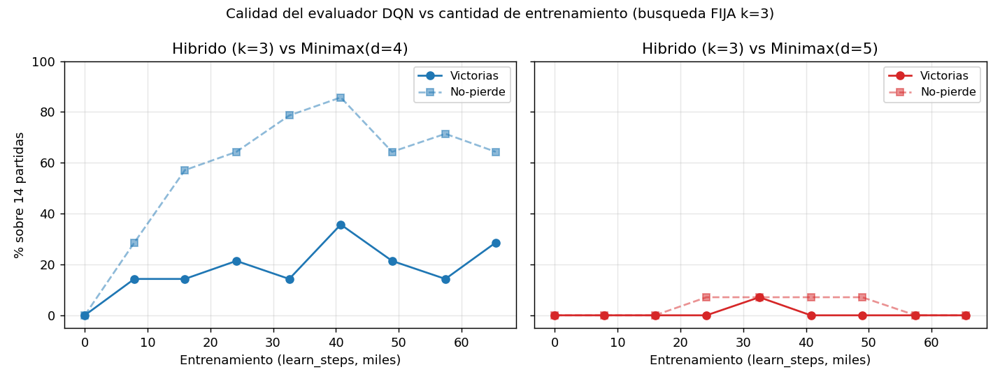
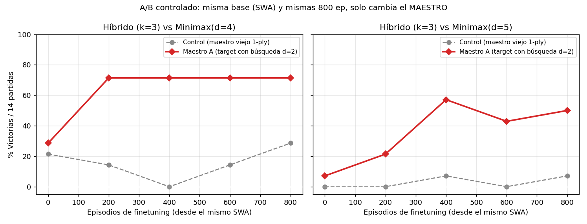

# Híbrido DQN + búsqueda: cruzar el muro d=5/d=6 y la palanca real

Este documento reúne la investigación sobre por qué el DQN no vence a Minimax de
profundidad alta y qué lo resuelve. Tres resultados, todos reproducibles con los scripts
del repo.

## 1. El muro estructural

El DQN entrenado (Fase 2: Double DQN, reward shaping, soft update, currículo vs d=3) vence
a Minimax de baja profundidad pero choca contra un muro:

| Oponente | DQN puro (greedy `argmax Q`) |
|----------|------------------------------|
| Minimax(d=3) | ~80 % victorias |
| Minimax(d=4) | ~63 % victorias |
| Minimax(d=5) | **0 %** |
| Minimax(d=6) | **0 %** |

**Causa:** el DQN decide en **una sola pasada, sin búsqueda hacia adelante**, mientras que
Minimax(d=5/6) hace *lookahead* de 5–6 plies. Es un límite **estructural**: ningún ajuste
de entrenamiento le da profundidad de cálculo.

## 2. El híbrido cruza el muro — pero solo a profundidad comparable

`HybridAgent` (`src/agents/hybrid.py`) envuelve el evaluador del DQN
(`V(s)=max_a Q(s,a)`) dentro de una búsqueda **negamax + poda alfa-beta** de profundidad k.
La red aporta la intuición posicional en las **hojas**; la búsqueda aporta el *lookahead*.

Evaluación **cost-matched** (`src/eval/hybrid_eval.py`): aperturas aleatorias, semillas
pareadas, y se reporta win-rate **junto con el costo** (nodos/jugada y ms/jugada), para una
comparación justa "a cómputo comparable" y no "quien busca más hondo gana". Como **control**
se corre el mismo buscador con la heurística a mano en vez del DQN, a igual k.

Win-rate del híbrido vs Minimax (np = no-pierde):

| k | DQN vs d5 | DQN vs d6 | Heur vs d5 | Heur vs d6 | ms/jugada DQN | ms/jugada Heur |
|---|-----------|-----------|------------|------------|---------------|----------------|
| 2 | 0 %       | 0 % (np30)| –          | –          | 3             | –              |
| 3 | 0 %       | 10 %      | 10 %       | 10 %       | 9             | 3              |
| 4 | 10 %(np20)| 10 %      | 0 %        | 10 %       | 22            | 10             |
| 5 | 25 %(np62)| 38 %(np62)| 50 %       | 20 %       | 53–76         | 29–38          |
| 6 | 33 %(np50)| 17 %(np83)| 30 %       | 30 %       | 66–186        | 49–87          |

**Lecturas:**
1. **El muro se cruza solo a profundidad de búsqueda comparable (k≥5).** A k≤4 el híbrido va
   0–10 %; a k=5 salta a 25–38 % de victorias y ~60 % de no-perder vs d=5/d=6.
2. **El evaluador DQN NO supera a la heurística a mano** a igual k (van parejos, con ruido) y
   **cuesta 2–4× más** (inferencia de red en hojas). No es *cost-effective*.
3. **El factor dominante es la profundidad de búsqueda, no el evaluador aprendido.**

## 3. ¿Más entrenamiento fortalece al evaluador? (calidad vs cantidad)

Experimento que **aísla la calidad del evaluador de la profundidad**: se reentrena con la
receta de Fase 2 guardando un snapshot cada 500 episodios, y cada snapshot se enchufa como
evaluador del híbrido a **profundidad FIJA k=3**, enfrentado a Minimax(d=4) y Minimax(d=5)
(14 partidas, aperturas aleatorias). Script: `src/eval/evaluator_quality.py`.



Datos: `results/evaluator_quality.csv`.

| learn_steps | vs d=4 (W% / NP%) | vs d=5 (W% / NP%) |
|-------------|-------------------|-------------------|
| 17 (sin entrenar) | 0 / 0   | 0 / 0 |
| 7 906   | 14 / 29 | 0 / 0 |
| 15 954  | 14 / 57 | 0 / 0 |
| 24 153  | 21 / 64 | 0 / 7 |
| 32 570  | 14 / 79 | 7 / 7 |
| **40 768 (ep2500)** | **36 / 86** | 0 / 7 |
| 48 940  | 21 / 64 | 0 / 7 |
| 57 428  | 14 / 71 | 0 / 0 |
| 65 439 (final) | 29 / 64 | 0 / 0 |

**Lecturas:**
1. **El entrenamiento SÍ fortalece el evaluador** contra oponentes alcanzables: sin entrenar
   pierde 14/14 vs d=4; entrenado llega a **86 % de no-perder**. La fuerza viene del
   entrenamiento, medido de forma directa.
2. **Pero satura y luego se estanca/retrocede:** el pico vs d=4 está en ~40k pasos (**ep2500**)
   y después baja a 64–71 %. Más entrenamiento del mismo tipo no ayuda — consistente con el
   olvido/colapso de distribución del auto-juego.
3. **Contra el muro d=5 la curva es plana en CERO**, sin importar la cantidad de entrenamiento.
   A profundidad k=3, ni el mejor checkpoint cruza d=5. **La palanca para d=5/d=6 es la
   profundidad de búsqueda, no el entrenamiento.**
4. **El checkpoint final no es el mejor:** ep2500 (86 % NP vs d=4) supera al final (64 %).
   Conviene seleccionar el checkpoint por evaluación, no usar siempre el último.

## 4. Maestro A: subir el techo del evaluador entrenándolo CON búsqueda

El límite del punto 3 no es del *entrenamiento* en abstracto, sino del **maestro**: el target
`y = r − γ·max Q(s')` solo mira **una jugada** (1-ply), así que la red nunca recibe la verdad
táctica de varias jugadas y su evaluación tiene techo. La cura es **cambiar el maestro**: que
el target use una **búsqueda negamax de profundidad d en s'** (la red como evaluador de hojas),
inyectando lookahead táctico a la señal de aprendizaje (idea de *expert iteration* / AlphaZero).
Implementado con el flag `--search-target-depth` (ver `agents/dqn.py::_search_bootstrap_values`).

**Experimento A/B controlado:** desde el MISMO checkpoint (SWA) y con las MISMAS 800 épocas de
finetuning, se entrenan dos modelos que solo difieren en el maestro: el viejo (1-ply, *control*)
y el nuevo (búsqueda d=2, *Maestro A*). Se reevalúan con la misma curva (híbrido k=3 vs d=4/d=5).



| Maestro (finetuning desde SWA) | vs d=4 (W) | vs d=5 (W) |
|--------------------------------|-----------|-----------|
| Control (1-ply, el viejo)      | 0–29 %    | **0–7 %** (≈ plano) |
| **Maestro A (búsqueda d=2)**   | **71 %**  | **21–57 %** |

Como el control queda plano con idéntico warm-start y épocas, la mejora es **causalmente del
maestro nuevo**, no de "entrenar más". Datos: `results/maestroA_eval_curve.csv`,
`results/maestroA_control_eval_curve.csv`.

**Matiz clave — evaluador vs jugador:** el Maestro A fortalece a la red como **evaluador**
(`V(s)=max_a Q(s,a)`, que la búsqueda explota), **no como jugador reactivo** (`argmax_a Q`).
Medido como DQN puro (k=1, sin búsqueda) el modelo NO mejora e incluso empeora; la ganancia se
cosecha **a través de la búsqueda**. Es decir: la búsqueda sigue siendo **irreducible**, pero el
Maestro A mueve parte de su costo del *inference* al *training* — con un evaluador entrenado-con-
búsqueda, una búsqueda **corta** rinde como una profunda con el evaluador viejo.

## 5. El agente final: vence a TODAS las profundidades

Combinando lo anterior —evaluador Maestro A + búsqueda k=5 en inferencia— se obtiene un agente
desplegable (`models/checkpoint_maestroA.pt` + el buscador del híbrido). Evaluación robusta de
**40 partidas** por profundidad, aperturas aleatorias y semillas pareadas:

| Oponente | W / L / D | Victorias | No-pierde | ms/jugada |
|----------|-----------|-----------|-----------|-----------|
| Minimax d=3 | 39 / 0 / 1 | **97.5 %** | 100 % | 58 |
| Minimax d=4 | 37 / 0 / 3 | **92.5 %** | 100 % | 72 |
| Minimax d=5 | 37 / 0 / 3 | **92.5 %** | 100 % | 80 |
| Minimax d=6 | 33 / 2 / 5 | **82.5 %** | 95 %  | 71 |

Solo **2 derrotas en 160 partidas**. El muro d=5/d=6 (antes 0 % victorias) queda en 92.5 %/82.5 %.
Datos: `results/agente_final_vs_minimax.csv`.

## Conclusión

El RL reactivo (1-ply) choca contra un muro estructural frente a búsqueda profunda. Hay **dos
palancas complementarias** para cruzarlo, y combinarlas da un agente que vence a Minimax en
**todas** las profundidades (d=3 a d=6):

1. **Búsqueda en inferencia** (híbrido): da el *lookahead* que al DQN reactivo le falta.
2. **Búsqueda en el entrenamiento** (Maestro A): sube el techo del **evaluador**, de modo que
   una búsqueda corta basta. La búsqueda es irreducible, pero su costo se reparte training/inference.

> *El RL puro pierde frente a búsqueda profunda. Un evaluador aprendido entrenado CON búsqueda,
> combinado con búsqueda en inferencia, no solo cruza el muro d=5/d=6 sino que lo domina
> (92.5 %/82.5 % de victorias). El evaluador mejora la calidad de juicio; la búsqueda la convierte
> en jugadas.*

## Reproducir

```bash
# 1) Entrenar guardando snapshots cada 500 episodios (receta Fase 2)
OMP_NUM_THREADS=4 .venv/bin/python src/selfplay.py --episodes 4000 --device cpu \
  --gamma 0.90 --lr 0.001 --buffer-capacity 200000 --eps-decay-steps 60000 \
  --capture-reward 0.05 --king-reward 0.2 --soft-tau 0.005 \
  --opponent-minimax-frac 0.5 --opponent-minimax-depth 3 \
  --checkpoint-dir models/snapshots --checkpoint-every 500

# 2) Curva calidad-del-evaluador (búsqueda fija k=3 vs d=4 y d=5)
OMP_NUM_THREADS=4 .venv/bin/python src/eval/evaluator_quality.py \
  --checkpoint-dir models/snapshots --depth 3 --opp-depths 4 5 --games 14 \
  --out results/evaluator_quality.csv

# 3) Híbrido cost-matched vs Minimax profundo
OMP_NUM_THREADS=4 .venv/bin/python src/eval/hybrid_eval.py \
  --eval dqn --checkpoint models/checkpoint_swa_fase2.pt --depth 5 --opp-depths 5 6 --games 10

# 4) Maestro A: finetuning con target por BÚSQUEDA (warm-start desde el SWA)
OMP_NUM_THREADS=4 .venv/bin/python src/selfplay.py --episodes 800 --device cpu \
  --gamma 0.90 --lr 0.001 --buffer-capacity 200000 --eps-decay-steps 60000 \
  --capture-reward 0.05 --king-reward 0.2 --soft-tau 0.005 \
  --opponent-minimax-frac 0.5 --opponent-minimax-depth 3 \
  --search-target-depth 2 --checkpoint models/checkpoint_swa_fase2.pt \
  --checkpoint-dir models/maestroA --checkpoint-every 200

# 5) Agente final desplegable (Maestro A + híbrido k=5) vs todas las profundidades
OMP_NUM_THREADS=4 .venv/bin/python src/eval/hybrid_eval.py \
  --eval dqn --checkpoint models/checkpoint_maestroA.pt --depth 5 --opp-depths 3 4 5 6 --games 40
```
